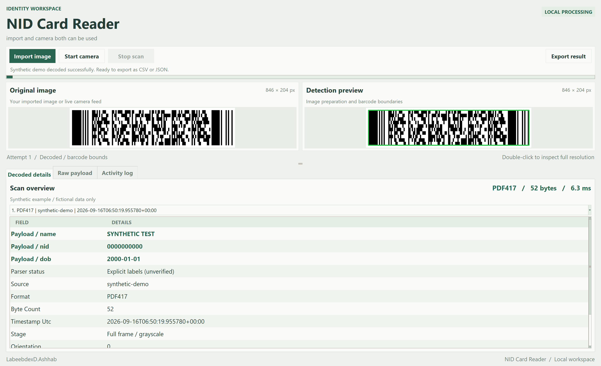
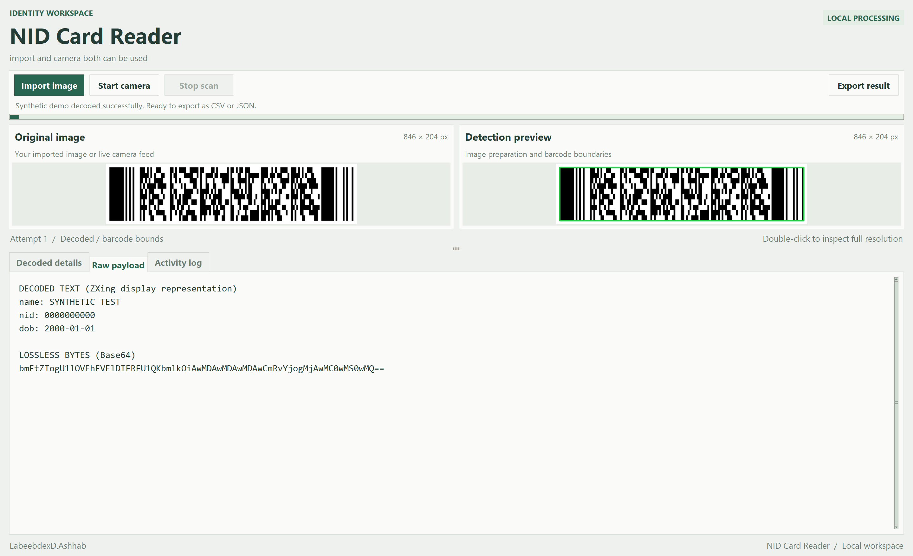

# NID Card Reader

Local Python tools for reading NID barcodes and creating degraded images to test reader robustness. The project contains two independent pipelines in the same directory:

| Pipeline | Entry point | Input | Output |
|---|---|---|---|
| Barcode reader | `app.py` (desktop) or `scan.py` (CLI) | Imported image or live camera | Structured results, raw bytes, CSV and JSON in `exports/` |
| Image degradation | `degrade_images.py` | High-quality images in `native_raw_img/` or `--image` | Mild, medium and hard variants in `low_img/<run-id>/` |

The degradation tool never calls the reader or changes its configuration. The reader uses only the image being scanned, not original-image lookups or earlier decoded records. A separate benchmark tool compares results against originals for evaluation only.

A local Python desktop application for scanning barcodes from photographs of the back of a Bangladeshi NID. OpenCV prepares images; ZXing-C++ decodes the barcode. Tkinter shows input, processing candidates, detected bounds, structured fields, raw payload and activity. Supports image files and continuous camera acquisition while decoding runs in background threads.

This is a barcode reader, not an NID authenticity or identity verification service. PDF417 is the primary intended format; QR Code, Data Matrix and Code 128 are enabled too. No authoritative NID payload schema is implemented. A limited private sample was used for local recovery testing, but it does not establish support for every card generation or payload layout. Unknown, encrypted or binary contents are retained without inventing identity fields.

## UI preview

The desktop workspace uses a soft sage palette, high-DPI text, resizable image previews and clearly separated results. These screenshots show the actual app with a generated barcode containing **fictional test data only**.

### Image preview and decoded details



Use **Import image** or **Start camera** to begin. The two panels show the source and current processing result; the lower panel presents parsed fields, the source, barcode format and timing. Double-click either image for its full-resolution view.

### Raw payload inspection



The **Raw payload** tab exposes decoded text and exact bytes encoded as Base64. **Activity log** records processing stages, while **Export result** saves the selected result using the configured formats.

To refresh these public screenshots on Windows, run `python tools/capture_readme_ui.py`. It generates its own fictional input in memory and disables automatic exports; it does not open private images.

## Windows quick start

Use Python 3.11 or newer with Tcl/Tk installed (included with the standard python.org Windows installation).

```powershell
python -m venv .venv
.\.venv\Scripts\python.exe -m pip install -r requirements.txt
.\.venv\Scripts\python.exe app.py
```

On Linux install your distribution's `python3-tk` package and use `.venv/bin/python`. macOS requires a Python installation with Tk support. No Java runtime, model download, API key or network connection is needed at runtime.

1. Choose **Import image** or **Start camera**. Processing previews update as candidates are tried; the input preview stays live during camera decoding.
2. Inspect **Decoded details**, **Raw payload** and **Activity log**. The source path/device is shown with each result. Starting a new import or camera session clears previous results; an unsuccessful decode shows no old payload. Select results from the current acquisition with the dropdown (latest 200 retained).
3. Successful payloads automatically save to `exports/` in both formats. **Export result** allows manual saving when auto-save is disabled or retrying a failed export.
4. Choose **Stop scan** to end capture. A running native decode operation finishes before stopping.

The Windows UI starts maximized with native DPI awareness for sharper text on high-resolution displays. Previews adapt to available space using high-quality resizing. Drag the horizontal divider to change the preview/result proportions, or double-click an image to inspect its original pixel resolution with scrollbars. These display settings do not change the decoder's configured processing resolution.

Generate a safe demo:

```powershell
.\.venv\Scripts\python.exe tools/make_demo.py
.\.venv\Scripts\python.exe scan.py examples/synthetic_pdf417.png
```

The example contains fictional labels and zeroes; it is not an official NID encoding. For batch/headless operation pass multiple filenames to `scan.py`. It returns exit code 1 if any input fails or has no readable barcode. CLI scans always save; `auto_save` controls the UI only.

## Main pipeline: capture to export

1. **Acquire:** load an imported image with EXIF orientation correction, or capture camera frames in a background thread.
2. **Prepare:** apply the fast preprocessing candidates below and display the current candidate in the UI.
3. **Recover:** if the fast path fails, try measured deskew, lighting normalization and additional recovery candidates within the configured limits.
4. **Decode:** accept valid ZXing results, preserve their exact bytes, and associate metadata with the current source image.
5. **Parse and display:** show explicit JSON properties, XML-like leaf tags or labeled text fields. Unrecognized content remains available as raw text and Base64 bytes.
6. **Save:** write per-record CSV/JSON exports, with session-level deduplication and atomic writes for each file.

EXIF orientation correction -> bounded image size -> grayscale decode -> optional card quadrilateral detection and perspective correction -> barcode-region proposals with margins -> nonlocal-means denoising -> CLAHE contrast -> Otsu/adaptive thresholds -> enlargement -> small-angle rotation candidates. ZXing also tries right-angle rotations and inverted symbols. Processing stops at the first successful candidate and returns all symbols found in that candidate; it is not an exhaustive search of every barcode on a page.

If the initial candidates fail, a second recovery stage measures tilt from image edges, corrects that angle, normalizes uneven lighting, retries aligned crops and scales, and tests unsharp masking, Sauvola/adaptive thresholds and multiple ZXing binarizers. These operations use only the supplied image. Originals, previous exports and degradation manifests are never consulted by the reader.

Cropping is heuristic. The full-frame path is retained if the proposed crop misses the symbol. No attempt is made to reconstruct erased bars or guess missing payload data. Candidate coordinates refer to the processed preview, not the original image. ZXing's reported orientation is relative to the successful candidate. Measured tilt is a heuristic, not arbitrary pose recovery. The capture device's actual resolution may differ from the request.

Recovery controls in `config.toml`: `recovery`, `recovery_attempts` (additional decoder calls, default 160), and `max_seconds` (20 seconds for imported images). `camera.max_scan_seconds` defaults to 2 seconds per camera pass. Time and cancellation checks happen between native operations; these are cooperative budgets, not hard realtime deadlines. More attempts cannot restore information removed by severe degradation. See [RECOVERY_NOTES.md](RECOVERY_NOTES.md) for the measured results and remaining hard-image limitation.

## Configuration

Edit `config.toml` and restart, or pass `--config path/to/config.toml` to either entry point. Relative output paths resolve against the configuration file's folder.

| Section | Settings |
|---|---|
| processing | Maximum image dimension, cropping, denoising, contrast, thresholding, enlargement factor, attempt limit, enabled barcode formats |
| camera | Device index, requested width/height, pause between decoding passes |
| output | Directory, `formats = ["csv", "json"]`, auto-save, session deduplication, spreadsheet-safe CSV text |

Input files are limited to 40 megapixels. The camera preview is independent of decoding, but decoding rate depends on resolution, image quality and CPU speed. Reduce `max_dimension` or `max_attempts` for lower latency; this can lower detection success. Full-resolution image loading occurs before downscaling.

## Export contract

Each successful symbol receives a UUID. `exports/<uuid>.json` and `exports/<uuid>.csv` contain the same record; the CSV has a header and one row. This avoids concurrent append corruption. Files are individually written via temporary files and atomic replacement. A failure between formats can leave a partial pair; retry **Export result** to complete it.

- `raw_bytes_base64`: lossless payload bytes returned by ZXing; authoritative for byte-for-byte recovery.
- `raw_text`: ZXing's display representation; may differ from a direct UTF-8 decode for binary/ECI content.
- `parsed`: only explicit JSON object properties, XML-like leaf tags or labeled `key: value` / `key=value` segments. This is not a validated Bangladesh government schema; partial parsing may leave other data only in the raw payload.
- Metadata: UUID, UTC timestamp, source, symbology, SHA-256, byte count, successful stage, attempt, orientation, stage-relative bounds and decode time.

JSON uses UTF-8. CSV uses UTF-8 with BOM for Excel, quoting via Python's CSV writer and JSON strings for nested fields. Spreadsheet formula-like text is prefixed with an apostrophe by default. Thus CSV display text may be changed for safety, but Base64 remains exact. Recover bytes with `base64.b64decode(record["raw_bytes_base64"])`.

Repeat payloads of the same format are suppressed within the current application session by default. Restarting permits another export; this is not a persistent database. Disabling deduplication permits repeated camera exports. Input images are not copied into the export directory. Outputs contain sensitive plaintext data and source paths; store them only in an appropriately protected local folder. `exports/` and `input/` are excluded from Git.

## Independent image degradation pipeline

Place high-quality input images in `native_raw_img/`, then run:

```powershell
.\.venv\Scripts\python.exe degrade_images.py
```

By default, every source produces **mild**, **medium** and **hard** versions. Each run writes to a new `low_img/<run-id>/` directory, preserving originals and previous runs. The input directory is searched recursively. Supported inputs: JPG/JPEG, PNG, BMP, TIFF and WebP; only the first frame/page is used for multi-frame formats.

The degradation pipeline applies EXIF orientation, a working-resolution cap, downsampling and enlargement, perspective distortion, rotation, Gaussian blur, motion blur, contrast/exposure changes, shadow, simulated glare, noise and JPEG compression. It applies these effects to the entire image without detecting or replacing the barcode. Rotation expands the canvas to avoid deliberately cropping corners.

```powershell
# A single image
.\.venv\Scripts\python.exe degrade_images.py --image "native_raw_img\example.jpg"

# One severity level, with a repeatable seed
.\.venv\Scripts\python.exe degrade_images.py --profile hard --seed 123
```

Edit `degradation.toml` to choose input/output folders, profiles, variants per profile, seed, effect strengths, maximum processing size, and JPG/PNG output. PNG files still contain the deliberately simulated JPEG artifacts. The same source, relative filename, parameters, seed and library versions reproduce the same image bytes.

Each run's `manifest.json` records source/output mappings, hashes, dimensions, parameters and errors. It can contain private filenames and belongs with the confidential test data. Invalid images are reported while the remaining inputs continue. Exit codes are `0` for success/empty input, `1` for failed inputs and `2` for configuration/setup errors.

To test a generated variant, launch `app.py` and use **Import image** to select it from `low_img/`. No-read results are legitimate benchmark outcomes: stronger degradation can destroy detail that no preprocessing can restore. See [DEGRADATION_README.md](DEGRADATION_README.md) for more details.

## Recovery results and limitations

On the limited private sample used during development, the original and mild variant decoded, the medium variant became readable after measured tilt correction with an exact payload match, and the hard variant remained unreadable. A higher-resolution synthetic barcode survives the hard profile and is covered by a regression test. Neither result guarantees performance on other images or camera environments.

To rerun the local comparison when originals and degradation manifests are available:

```powershell
.\.venv\Scripts\python.exe tools/benchmark_reader.py
```

The benchmark uses originals only as evaluation ground truth and writes metadata to `tmp/reader_benchmark.json`, without decoded identity fields. See [RECOVERY_NOTES.md](RECOVERY_NOTES.md) for the measurements, experiments and remaining limitations. Testing has been performed on Windows; other operating systems and camera hardware still need validation.

## Project structure

```text
app.py                    Desktop reader
scan.py                   Batch/CLI reader
config.toml               Shared reader defaults (no secrets)
nid_scanner/              Preprocessing, recovery, decoding, parsing, export and theme
degrade_images.py         Independent degradation tool
degradation.toml          Shared degradation defaults (no secrets)
native_raw_img/           Private originals; ignored by Git
low_img/                  Private degraded variants/manifests; ignored by Git
exports/                  Private decoded records; ignored by Git
tools/                    Synthetic demo, benchmark, UI smoke check and PDF builder
tests/                    Synthetic tests and optional private local regression
output/pdf/               Generated pipeline comparison document
LICENSE                   MIT license
```

## Tests and documentation

```powershell
.\.venv\Scripts\python.exe -m pip install -r requirements-dev.txt
.\.venv\Scripts\python.exe -m pytest -q
.\.venv\Scripts\python.exe tools/build_report.py
```

Tests exercise generated PDF417 codes at four rotations, blur/noise/skew, binary bytes, EXIF orientation, empty frames, cancellation, crop/processing candidates, parsing, CSV/JSON round-trip, deduplication and export-failure retry. They do not establish real NID read rates. Camera hardware and actual NID payload interpretation require field testing. The PDF report is at `output/pdf/pipeline_alternatives.pdf`; its builder is reproducible.

Additional tests cover deterministic degradation, unchanged originals, recovery, and camera-to-import result isolation. Private fixtures are not distributed; their tests skip when absent. Synthetic image files are also ignored by default and can be recreated with `tools/make_demo.py`. The README and recovery notes describe the current pipeline; the PDF documents the initial decoder selection and alternatives.

## Confidential files and GitHub publishing

`.gitignore` excludes the original/degraded image folders, exports, input captures, screenshots, temporary diagnostics, logs, common image/video formats, CSV/JSON records, spreadsheets, databases, archives, credentials and environment files. This also catches common confidential file types accidentally saved outside their intended folders. The only allowlisted PDF is the documentation-only `output/pdf/pipeline_alternatives.pdf`; review it again if its contents change.

Keep shared `config.toml` and `degradation.toml` free of secrets and personal paths. For personal settings, copy them to `config.local.toml` / `degradation.local.toml` (ignored by Git) and pass the appropriate `--config` argument. Source code, tests, Markdown documentation, requirements and the MIT license are intended for publication.

Ignore rules cannot identify confidential content embedded in an otherwise public source/text file, and do not remove files already tracked or present in Git history. Before publishing, review the staged file list and contents with `git diff --cached --name-only` and `git diff --cached`. Do not force-add private data. If private files were previously committed, ignoring them alone is insufficient; untrack them and assess whether repository-history cleanup is required.

## License

The project code is available under the [MIT License](LICENSE). Third-party dependencies retain their own licenses. Private identity images and extracted personal records are not included in the public project distribution.

## Why this decoder?

ZXing-C++ provides native Python bindings and supports PDF417 as well as other common 2D formats. OpenCV is useful for geometry and filtering, but its dedicated barcode decoder covers EAN/UPC retail formats rather than PDF417. Consequently OpenCV plus ZXing-C++ is the recommended starting pipeline here. There is no measured evidence yet that another engine would perform better on this user's NIDs.

Alternatives include the Java ZXing implementation, ZBar/pyzbar for supported 1D/QR workloads, commercial PDF417 SDKs evaluated against a labeled dataset, and OCR as a separate text extraction feature. OCR cannot recover exact barcode bytes or replace decoding. See the PDF for tradeoffs and a proposed evaluation procedure.

Primary references:

- [ZXing-C++ formats and project](https://github.com/zxing-cpp/zxing-cpp)
- [Official Python bindings](https://github.com/zxing-cpp/zxing-cpp/tree/master/wrappers/python)
- [OpenCV barcode tutorial](https://docs.opencv.org/5.0/tutorials/objdetect/barcode_detect_and_decode/barcode_detect_and_decode.html)
- [pyzbar project and scope](https://github.com/NaturalHistoryMuseum/pyzbar)
- [Java ZXing](https://github.com/zxing/zxing)

## Troubleshooting

No result: use a sharp, evenly lit close-up with the entire barcode and its margins visible. Avoid glare and digital zoom. Try a higher-resolution still image. A successful decode with opaque data means the barcode was read but its contents have no recognized explicit labels; check the raw payload.

Camera unavailable: change `camera.index`, allow desktop camera access in Windows privacy settings, and close other camera apps. Fonts: install a Bengali-capable system font if Bengali text displays as boxes. Import errors: use the same virtual-environment Python for installation and launch. Export errors: check directory permissions and disk space, then retry saving the selected result.
